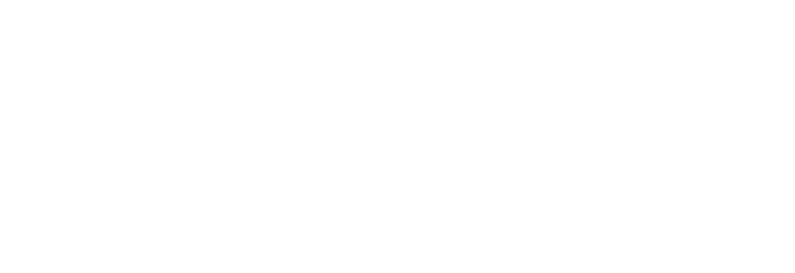

## The Power of the Human Brain

The human brain can hold up **2.5 Petabytes (PB)** of information—whole libraries of raw data. Yet, we forget. As software engineers, new technologies are made each day, from incredible ones like **Rust** to mindblowing ones like **D# (DogeSharp)**. It’s easy to forget them all. **To conclude this paragraph in a sentence:**

> Life is fleeting and so are our thoughts.

## Introducing Re

<p align="center">
  <a href="https://pro-lamap.vercel.app/" target="_blank">
  
  </a>
</p>
<div align="center">
<a target="_blank" href="https://opensource.org/licenses/Apache-2.0" style="background:none">
    
</a>
<a target="_blank" href="https://discord.gg/4WAVaNqSK2" style="background:none">
    
</a>
</div>
The purpose of Re is to hold the crucial languages, algorithms, and data structures for you to:

- **Learn**
- **Remember**
- **Reapply** into your code

Our goal is to put in the hands of everyone the knowledge of programming. Think of it as a dictionary for all the programming knwoledge with languages, algorithms and data structure whenever you need them. A goodbye to searching **10 websites** and **5 tutorials** to find how to apply **Dijkstra's algorithm** (or in my case, how to spell it).

With **Re**, you can search it up fast and reliably.

## How to get started

Thank you for being interested in contributing, these are the steps to start working on the project:

1. **Clone the repository**:

```bash
   git clone https://github.com/qReReRe/Re.git
```

2. **Install dependencies**:

```bash
  npm install
```

3. **Run the development server**:

```bash
  npm run dev
```

4. **Open the browser and start contributing!**
   Feel free to make any changes you see ncessary, fix bugs and/or add features. Who knows? You could even improve this README.
5. **Submit the pull request to share your changes with us :)**

Refer to [Contributing](https://github.com/qReReRe/Re/blob/eb5b156253980015e2abd797f42447b280c0ce19/.github/CONTRIBUTING.md) for more information.

## Working Live

Youtube: [@Dchange1](https://www.youtube.com/@Dchange1)
Twitch: [@Vchanging](https://www.twitch.tv/vchanging)

## License

[Apache 2.0 © 2023 Continue Dev, Inc.](./LICENSE)
